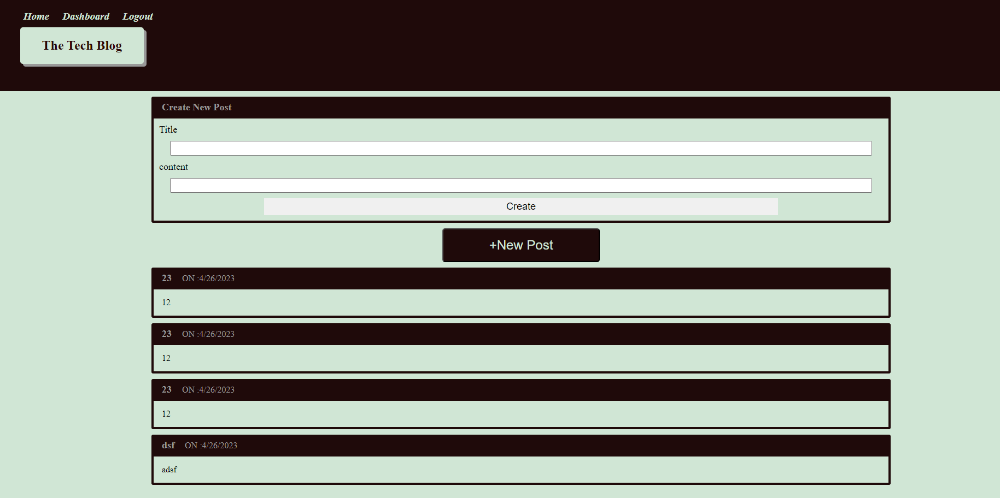

#  BITTER VS OF TWITTER

## Description

### What was your motivation?

* i wanted to understand mysql better
### Why did you build this project? 
* it solves being able to find a place to talk about the topics people enjoy
### What problem does it solve?
* i built this to understand nosql and handle bars
### What did you learn?
* i learn how to connect a nosql with primary keys and etc
## Table of Contents

If your README is long, add a table of contents to make it easy for users to find what they need.

- [Installation](#installation)
- [Usage](#usage)
- [Credits](#credits)
- [License](#license)

## Installation

For installation please go to your cli and clone this url undefined
To use this generator, simply clone the repository to your local machine and run the index.js 
file in your terminal. The tool will guide you through the process of creating your
 readme.md file, providing helpful prompts and examples along the way. Once you have
 completed the prompts, your new readme.md file will be generated and ready to use.

## Usage

    

## Credits
* Collaborators
https://github.com/heav3n21

## License
MIT
## Technology
js css and handlebars
